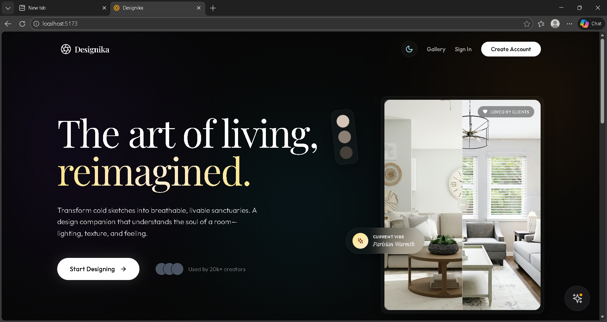
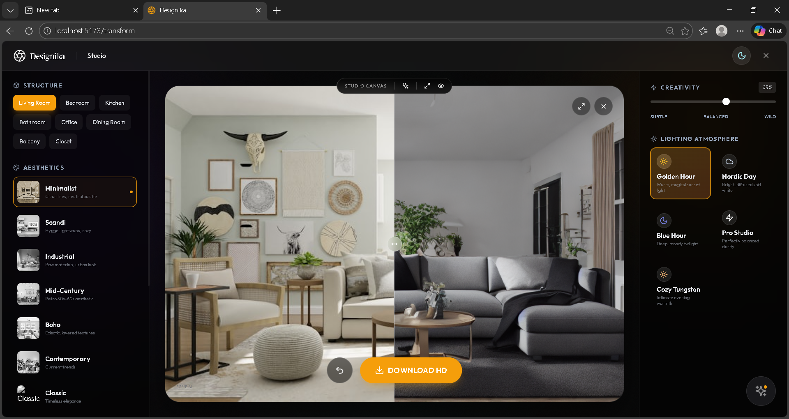
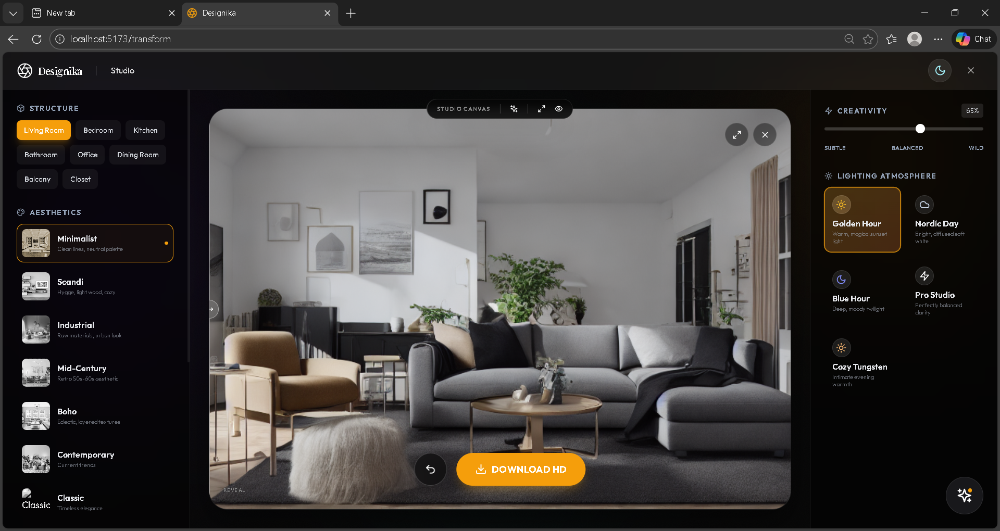
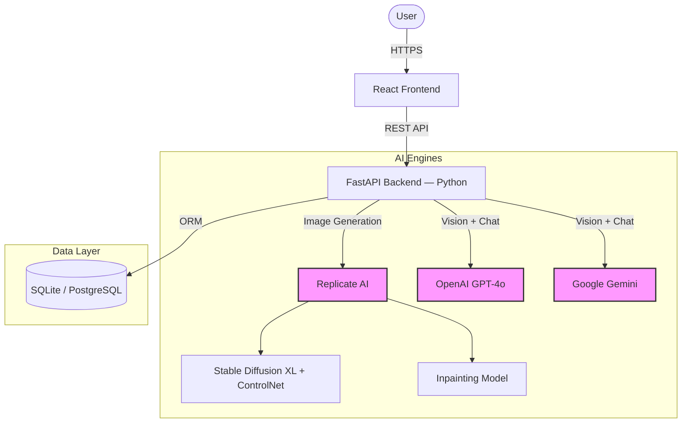

# 🎨 Interior Design AI — Designika

**Transform your living space using the world's most advanced AI models.**



> *"Like having a professional interior designer in your pocket."*
> A production-ready, full-stack application combining **Generative AI (Stable Diffusion XL)**, **Multimodal LLMs (GPT-4o / Gemini)**, and **agentic orchestration** to reimagine interior spaces in seconds.

---

## ✨ Key Features

| Feature | Description |
| :--- | :--- |
| 🏠 **Real-Time Restyling** | Upload a photo and convert it to **12+ design styles** (Minimalist, Scandi, Industrial, etc.) using **ControlNet** to preserve structural integrity. |
| 🪄 **Magic Eraser** | Intelligently remove unwanted clutter using **Inpainting** models. |
| 🧠 **Designika AI Assistant** | A floating AI consultant powered by **GPT-4o / Gemini** — it *sees* your room and suggests furniture, palettes, and layouts in rich Markdown. |
| 💬 **Rich Chat** | Receive design advice with formatted text, bullet points, and organized lists. |
| 🤖 **Agent Brain** | Multi-agent orchestration with LangGraph, CrewAI, and memory (Mem0) for intelligent workflows. |
| 📂 **Design Gallery & History** | Browse inspiration and revisit all your past transformations. |
| 🔐 **JWT Auth** | Secure local authentication with bcrypt hashing and token-based sessions. |
| 🌗 **Dark / Light Mode** | Glassmorphic premium UI with Framer Motion animations and theme persistence. |

---

## 📸 See It In Action

### 🎥 Live Demo


### 🖼️ Transformation Gallery
| Original Room | Minimalist Restyle |
| :---: | :---: |
|  |  |

---

## 🏗️ System Architecture



---

## 🛠️ Tech Stack

### Frontend
| Technology | Purpose |
| :--- | :--- |
| **React 18** + **Vite** | UI framework + blazing fast dev server |
| **TypeScript** | Type-safe development |
| **TailwindCSS** | Utility-first styling |
| **Framer Motion** | Smooth animations & transitions |
| **Zustand** | Lightweight persistent state management |
| **React Router v6** | Client-side routing |
| **Three.js / Spline** | 3D visual elements |
| **React Markdown** | Rich text rendering for AI chat |
| **Lucide React** | Icon library |
| **Axios + React Query** | API communication & caching |

### Backend (Python — Primary)
| Technology | Purpose |
| :--- | :--- |
| **FastAPI** | Async REST API framework |
| **SQLAlchemy** | ORM (SQLite dev / PostgreSQL prod) |
| **Pydantic** | Request/response validation |
| **python-jose + passlib** | JWT auth + bcrypt password hashing |
| **Replicate SDK** | AI image generation |
| **OpenAI SDK** | GPT-4o multimodal chat |
| **LiteLLM** | Unified LLM gateway (OpenAI, Gemini, etc.) |
| **CrewAI + LangGraph** | Multi-agent orchestration |
| **Mem0** | Persistent AI memory (Local) |
| **SlowAPI** | Rate limiting (Local Memory) |
| **Resend** | Transactional emails |

### Infrastructure
| Technology | Purpose |
| :--- | :--- |
| **Docker + Docker Compose** | Container orchestration |
| **Nginx** | Reverse proxy |
| **GitHub Actions** | CI/CD workflows |

---

## 📁 Project Structure

```
interior-design-ai/
├── backend/                    # 🐍 Python FastAPI Backend
│   ├── main.py                 # App entry point (v2.3.0)
│   ├── config.py               # Centralized settings (Environment variables)
│   ├── database.py             # SQLAlchemy engine & session
│   ├── models.py               # User, Design models
│   ├── routers/                # API Route handlers
│   │   ├── auth.py             #   JWT Login / Register
│   │   ├── transform.py        #   Image restyling (ControlNet)
│   │   ├── chat.py             #   AI chat
│   │   ├── inpainting.py       #   Magic Eraser
│   │   ├── design.py           #   Design CRUD
│   │   ├── users.py            #   User profiles
│   │   ├── agent.py            #   Agent Brain (LangGraph)
│   │   └── assistant.py        #   AI Assistant (26K LOC)
│   ├── services/               # Business Logic
│   │   ├── ai_service.py       #   Replicate + ControlNet
│   │   ├── llm_gateway.py      #   LiteLLM unified gateway
│   │   ├── memory_service.py   #   Mem0 persistent memory
│   │   ├── rag_service.py      #   RAG pipeline (Haystack)
│   │   ├── email_service.py    #   Resend emails
│   │   └── storage.py          #   File uploads
│   ├── utils/                  # Clients & Helpers
│   │   └── security.py         #   JWT + password hashing
│   ├── middleware/             # Rate limiting
│   └── requirements.txt        # Python dependencies
│
├── frontend/                   # ⚛️ React TypeScript Frontend
│   ├── src/
│   │   ├── App.tsx             #   Root app with routing
│   │   ├── pages/
│   │   │   ├── HomePage.tsx    #     Landing page
│   │   │   ├── TransformPage.tsx #   AI transformation studio
│   │   │   ├── GalleryPage.tsx #     Design inspiration
│   │   │   ├── HistoryPage.tsx #     Past transformations
│   │   │   ├── ProfilePage.tsx #     User profile & settings
│   │   │   └── auth/           #     Login + Register
│   │   ├── components/
│   │   │   ├── assistant/      #     Floating AI consultant
│   │   │   ├── transform/      #     Upload, style picker, comparison
│   │   │   ├── gallery/        #     Gallery grid
│   │   │   ├── landing/        #     Hero, features, about
│   │   │   ├── layout/         #     Shared layout
│   │   │   ├── chat/           #     Chat interface
│   │   │   ├── history/        #     History cards
│   │   │   └── ui/             #     Buttons, cards, toggles
│   │   ├── store/              #     Zustand stores (auth, theme, design)
│   │   └── lib/                #     API client
│   ├── tailwind.config.js
│   └── vite.config.ts
│
├── docs/                       # 📚 Documentation
├── .github/workflows/          # 🔄 CI/CD pipelines
├── docker-compose.yml          # 🐳 Docker orchestration
└── .gitignore                  # 🔒 Security-hardened ignore rules
```

---

## 🚀 Quick Start Guide

### Prerequisites
- **Node.js 18+**
- **Python 3.10+**
- API Keys: [OpenAI](https://platform.openai.com/), [Replicate](https://replicate.com/), [Google Gemini](https://aistudio.google.com/) *(optional)*

### 1. Clone & Setup Environment

```bash
git clone https://github.com/your-username/interior-design-ai.git
cd interior-design-ai
```

### 2. Backend (Python FastAPI)

```bash
cd backend

# Create virtual environment
python -m venv venv
# Windows:
.\venv\Scripts\activate
# Mac/Linux:
source venv/bin/activate

# Install dependencies
pip install -r requirements.txt

# Create your .env file (NEVER commit this)
copy ..\.env.example .env
# Edit .env with your actual API keys

# Start server
uvicorn main:app --reload
```
> 🟢 Server runs at **http://127.0.0.1:8000**
> 📖 API Docs at **http://127.0.0.1:8000/docs**

### 3. Frontend (React + Vite)

```bash
cd frontend
npm install
npm run dev
```
> 🟢 App runs at **http://localhost:5173**

### 4. Environment Variables

Create `.env` in `backend/` with:

```env
PORT=8000
DATABASE_URL=sqlite:///./interior.db
JWT_SECRET=your-secret-key-change-in-production
REPLICATE_API_TOKEN=r8_your_replicate_token
OPENAI_API_KEY=sk-your_openai_key
NODE_ENV=development
```

> [!CAUTION]
> **Never commit `.env` files.** The `.gitignore` is configured to exclude all `.env*` files (except `.env.example`).

---

## 🔌 API Endpoints

### Authentication
| Method | Endpoint | Description |
| :--- | :--- | :--- |
| `POST` | `/api/v1/auth/register` | User registration |
| `POST` | `/api/v1/auth/login` | User login (returns JWT) |

### Transform (AI Restyling)
| Method | Endpoint | Description |
| :--- | :--- | :--- |
| `POST` | `/api/v1/transform` | Start a transformation |
| `GET` | `/api/v1/transform/styles` | List available styles |

### Designs
| Method | Endpoint | Description |
| :--- | :--- | :--- |
| `GET` | `/api/v1/designs` | List user designs |
| `POST` | `/api/v1/designs` | Save a design |
| `DELETE` | `/api/v1/designs/{id}` | Delete a design |

### AI Chat & Assistant
| Method | Endpoint | Description |
| :--- | :--- | :--- |
| `POST` | `/api/v1/chat` | Chat with AI designer |
| `POST` | `/api/v1/assistant/*` | Designika AI Assistant endpoints |

### Inpainting (Magic Eraser)
| Method | Endpoint | Description |
| :--- | :--- | :--- |
| `POST` | `/api/v1/inpainting` | Remove objects from images |

### Agent & Workflows
| Method | Endpoint | Description |
| :--- | :--- | :--- |
| `POST` | `/api/v1/agent/run` | Run agent pipeline |

---

## 🤖 AI Models Used

| Feature | Engine | Capabilities |
| :--- | :--- | :--- |
| **Interior Restyling** | Stable Diffusion XL | Photorealistic textures and lighting |
| **Geometry Lock** | ControlNet | Preserves walls, windows, structure |
| **Object Removal** | Inpainting | Seamless gap filling |
| **Design Consultant** | GPT-4o (Omni) | Multimodal text + vision reasoning |
| **Smart Assistant** | Google Gemini | Alternative multimodal AI |
| **Memory** | Mem0 | Remembers user preferences across sessions |
| **Agent Orchestration** | LangGraph + CrewAI | Multi-agent task decomposition |

---

## 🎨 Available Design Styles

| # | Style | Aesthetic |
| :--- | :--- | :--- |
| 1 | **Modern Minimalist** | Clean lines, neutral colors |
| 2 | **Scandinavian** | Light wood, hygge warmth |
| 3 | **Industrial** | Exposed brick, metal accents |
| 4 | **Mid-Century Modern** | Retro 50s/60s design |
| 5 | **Bohemian** | Eclectic, colorful, layered |
| 6 | **Contemporary** | Current trends, sophisticated |
| 7 | **Traditional** | Classic, elegant |
| 8 | **Coastal** | Beach house, blue/white palette |
| 9 | **Farmhouse** | Rustic, shiplap, barn doors |
| 10 | **Art Deco** | 1920s glamour, geometric |
| 11 | **Japanese Zen** | Wabi-sabi, natural materials |
| 12 | **Transitional** | Classic meets contemporary |

---

## 🔒 Security

- All API keys loaded via environment variables (never hardcoded)
- `.gitignore` blocks all `.env*` files, database files, certificates, and secrets
- Passwords hashed with **bcrypt** via passlib
- JWT tokens for stateless authentication
- Rate limiting via **SlowAPI** (In-Memory)

---

## 🐳 Docker

```bash
# Development
docker-compose up -d
```

---

## 📄 License

**© 2026 AllCognix AI Technologies Pvt Limited.** All rights reserved.

Built by **Joy Biswas** — [joy@allcognix.com](mailto:joy@allcognix.com)
